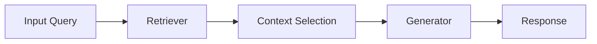

# Core Concepts

Empire Chain is built around several core concepts that work together to provide a comprehensive AI development framework.

## Language Models (LLMs)

Empire Chain supports multiple LLM providers through a unified interface:

```python
from empire_chain.llms import OpenAILLM, AnthropicLLM, GroqLLM

# OpenAI
openai_llm = OpenAILLM("gpt-4")

# Anthropic
anthropic_llm = AnthropicLLM("claude-3-sonnet")

# Groq
groq_llm = GroqLLM("mixtral-8x7b")
```

Each LLM implementation provides consistent methods:
- `generate()`: Generate text based on a prompt
- Error handling and retry logic
- Streaming support where available

## Vector Stores

Vector stores are used for efficient similarity search and retrieval:

```python
from empire_chain.vector_stores import QdrantVectorStore, ChromaVectorStore

# In-memory Qdrant store
qdrant_store = QdrantVectorStore(":memory:")

# Persistent ChromaDB store
chroma_store = ChromaVectorStore()
```

Common operations:
- `add()`: Add text and embeddings
- `query()`: Retrieve similar documents
- `delete()`: Remove documents
- `clear()`: Reset the store

## Embeddings

Embeddings convert text into vector representations:

```python
from empire_chain.embeddings import OpenAIEmbeddings

embeddings = OpenAIEmbeddings("text-embedding-3-small")
vector = embeddings.embed("Your text here")
```

Features:
- Batched processing
- Caching support
- Error handling

## Document Processing

The document processing system handles various file formats:

```python
from empire_chain.file_reader import DocumentReader

reader = DocumentReader()
text = reader.read("document.pdf")  # Supports PDF, DOCX, etc.
```

Capabilities:
- PDF processing with PyPDF2
- Word document processing with python-docx
- Text extraction and cleaning
- Metadata handling

## Speech Processing

Speech-to-Text capabilities are provided through various models:

```python
from empire_chain.stt import GroqSTT

stt = GroqSTT()
text = stt.transcribe("audio.mp3")
```

Features:
- Audio file support
- Real-time transcription
- Multiple language support

## Web Crawling

Web content extraction is handled through crawl4ai:

```python
from empire_chain.crawl4ai import Crawler

crawler = Crawler()
data = crawler.crawl("https://example.com")
```

Capabilities:
- HTML parsing
- Content extraction
- Rate limiting
- Error handling

## Data Visualization

The visualization system provides tools for data analysis:

```python
from empire_chain.visualizer import DataAnalyzer, ChartFactory

analyzer = DataAnalyzer()
data = analyzer.analyze(your_data)
chart = ChartFactory.create_chart('Bar Graph', data)
```

Chart types:
- Bar graphs
- Line charts
- Scatter plots
- Custom visualizations

## Interactive Interfaces

Streamlit-based interfaces for various applications:

```python
from empire_chain.streamlit import Chatbot, VisionChatbot, PDFChatbot

# Text chatbot
chatbot = Chatbot(llm=OpenAILLM("gpt-4"))

# Vision chatbot
vision_bot = VisionChatbot()

# PDF chatbot
pdf_bot = PDFChatbot(
    llm=OpenAILLM("gpt-4"),
    vector_store=QdrantVectorStore(":memory:")
)
```

Features:
- File upload
- Interactive chat
- Real-time responses
- Error handling

## PhiData Agents

Specialized agents for specific tasks:

```python
from empire_chain.phidata_agents import PhiWebAgent, PhiFinanceAgent

web_agent = PhiWebAgent()
finance_agent = PhiFinanceAgent()
```

Capabilities:
- Web search and analysis
- Financial data processing
- Task automation
- Structured output

## Document Analysis

Advanced document analysis with Docling:

```python
from empire_chain.docling import Docling

docling = Docling()
analysis = docling.generate("Analyze this document")
```

Features:
- Content analysis
- Topic extraction
- Summary generation
- Key point identification

## Processing Pipeline

The processing pipeline consists of several stages:

1. **Input Processing**
   - Document loading
   - Format detection
   - Initial preprocessing

2. **Content Extraction**
   - Text extraction
   - Structure analysis
   - Metadata collection

3. **Analysis**
   - Content analysis
   - Feature extraction
   - Entity recognition

4. **Output Generation**
   - Response formatting
   - Result compilation
   - Export handling

## Visualization System

The visualization system provides tools for:

- Data plotting
- Process monitoring
- Result analysis
- Interactive dashboards

## RAG Architecture

The RAG (Retrieval Augmented Generation) system consists of:

### Components
1. **Document Indexer**
   - Processes and indexes documents
   - Creates searchable representations

2. **Retriever**
   - Searches for relevant information
   - Ranks and filters results

3. **Generator**
   - Combines retrieved information
   - Generates coherent responses

### Flow


## Error Handling

Empire Chain uses a hierarchical error system:

```python
from empire_chain.exceptions import (
    EmpireChainError,
    DocumentError,
    ModelError,
    ConfigError
)
```

## Configuration System

### Levels of Configuration
1. **Global Configuration**
   - System-wide settings
   - Default behaviors

2. **Component Configuration**
   - Component-specific settings
   - Override capabilities

3. **Runtime Configuration**
   - Dynamic settings
   - Session-specific overrides

## Event System

The event system allows for:

- Progress monitoring
- Status updates
- Error tracking
- Custom callbacks

```python
from empire_chain.events import EventHandler

def on_document_processed(event):
    print(f"Processed: {event.document_id}")

handler = EventHandler()
handler.subscribe("document_processed", on_document_processed)
```

## Extension System

Empire Chain can be extended through:

1. **Custom Processors**
2. **Model Adapters**
3. **Pipeline Stages**
4. **Visualization Components**

Example of a custom processor:

```python
from empire_chain.processors import BaseProcessor

class CustomProcessor(BaseProcessor):
    def process(self, document):
        # Custom processing logic
        return processed_document
``` 