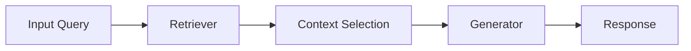

# Core Concepts

Empire Chain is built around several core concepts that work together to provide a powerful and flexible framework for AI applications.

## Document Processing

### The Docling Class

The `Docling` class is the central component for document processing:

```python
from empire_chain.docling import Docling

doc = Docling("document.pdf")
```

Key features:
- Document loading and parsing
- Text extraction and preprocessing
- Metadata handling
- Content transformation

## Language Model Integration

Empire Chain provides seamless integration with various Language Models:

### Model Types
1. **Local Models**: Run models directly on your machine
2. **API-based Models**: Connect to services like OpenAI
3. **Custom Models**: Integrate your own models

### Configuration

```python
config = {
    "model_type": "api",
    "provider": "openai",
    "model_name": "gpt-3.5-turbo",
    "api_key": "your-api-key"
}
```

## Data Structures

### Document Store
- Efficient storage and retrieval of documents
- Indexing for quick searches
- Version control and history

### Vector Store
- Embedding storage
- Similarity search
- Clustering capabilities

## Processing Pipeline

The processing pipeline consists of several stages:

1. **Input Processing**
   - Document loading
   - Format detection
   - Initial preprocessing

2. **Content Extraction**
   - Text extraction
   - Structure analysis
   - Metadata collection

3. **Analysis**
   - Content analysis
   - Feature extraction
   - Entity recognition

4. **Output Generation**
   - Response formatting
   - Result compilation
   - Export handling

## Visualization System

The visualization system provides tools for:

- Data plotting
- Process monitoring
- Result analysis
- Interactive dashboards

## RAG Architecture

The RAG (Retrieval Augmented Generation) system consists of:

### Components
1. **Document Indexer**
   - Processes and indexes documents
   - Creates searchable representations

2. **Retriever**
   - Searches for relevant information
   - Ranks and filters results

3. **Generator**
   - Combines retrieved information
   - Generates coherent responses

### Flow


## Error Handling

Empire Chain uses a hierarchical error system:

```python
from empire_chain.exceptions import (
    EmpireChainError,
    DocumentError,
    ModelError,
    ConfigError
)
```

## Configuration System

### Levels of Configuration
1. **Global Configuration**
   - System-wide settings
   - Default behaviors

2. **Component Configuration**
   - Component-specific settings
   - Override capabilities

3. **Runtime Configuration**
   - Dynamic settings
   - Session-specific overrides

## Event System

The event system allows for:

- Progress monitoring
- Status updates
- Error tracking
- Custom callbacks

```python
from empire_chain.events import EventHandler

def on_document_processed(event):
    print(f"Processed: {event.document_id}")

handler = EventHandler()
handler.subscribe("document_processed", on_document_processed)
```

## Extension System

Empire Chain can be extended through:

1. **Custom Processors**
2. **Model Adapters**
3. **Pipeline Stages**
4. **Visualization Components**

Example of a custom processor:

```python
from empire_chain.processors import BaseProcessor

class CustomProcessor(BaseProcessor):
    def process(self, document):
        # Custom processing logic
        return processed_document
``` 